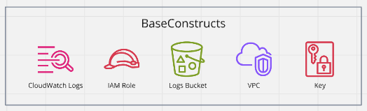
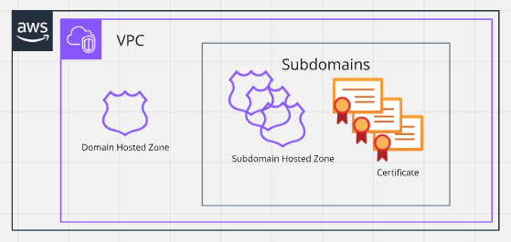
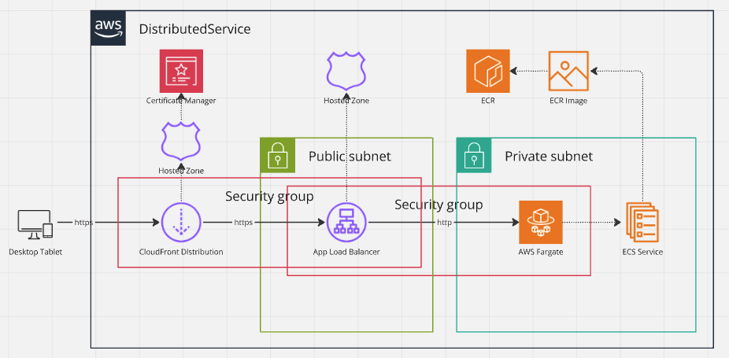
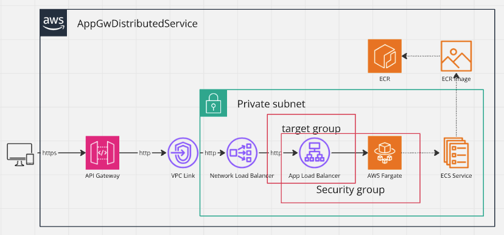
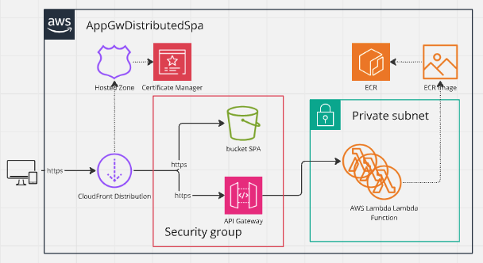
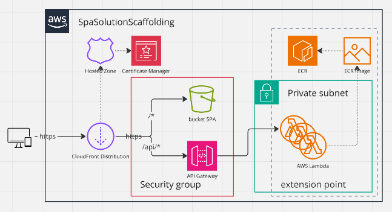

# infrastructure-blueprints
reusable solutions for infrastructure using aws-cdk

This repository publishes `@jtviegas/cdk-blueprints` to [npm registry](https://www.npmjs.com/package/@jtviegas/cdk-blueprints).

# usage

- install the library: `npm install @jtviegas/cdk-blueprints`

# constructs

## common properties interfaces

```
export interface VpcLookupAttributes {
  readonly vpcId: string;
  readonly vpcName: string;
}

export interface SysEnv {
  readonly name: string;
  readonly region: string;
  readonly account: string;
  readonly domain?: {
    name: string;
    private: boolean;
  },
  readonly vpc?: VpcLookupAttributes;
}

export interface CommonStackProps extends StackProps {
  readonly env: SysEnv;
  readonly organisation: string;
  readonly department: string;
  readonly solution: string;
}
```

## BaseConstructs


### constructor properties
```
export interface CommonStackProps extends StackProps {
  readonly env: SysEnv;
  readonly organisation: string;
  readonly department: string;
  readonly solution: string;
}
```
### interface
```
export interface IBaseConstructs {
  readonly key: IKey;
  readonly logGroup: ILogGroup;
  readonly logsBucket: IBucket;
  readonly role: IRole;
  readonly vpc: IVpc;
}
```
### usage example
```
class BaseStack extends cdk.Stack {
  readonly baseConstructs: IBaseConstructs;

  constructor(scope: Construct, id: string, props: CommonStackProps) {
    super(scope, id, props);
    this.baseConstructs = new BaseConstructs(this, `${id}-baseConstructs`, props)
  }
}

const baseProps: CommonStackProps = {
  crossRegionReferences: true,
  organisation: "nn",
  department: "dsss",
  solution: "testdsrv",
  env: environment,
  tags: {
    organisation: "nn",
    department: "dsss",
    solution: "testdsrv",
    environment: environment.name,
  },
  stackName: "BaseStack"
}

const baseStack = new BaseStack(app, "BaseStack", baseProps);
```

... in the stack you could also have used the static lookup function:

```
export interface BaseConstructsLookup {
  readonly keyArn: string;
  readonly logGroupArn: string;
  readonly logsBucketArn: string;
  readonly roleArn: string;
  readonly vpcId: string;
}


this.baseConstructs = BaseConstructs.fromProps(this, `${id}-baseConstructs`, props)
```

## PublicSubdomain


### usage example
```
interface SubdomainStackProps extends PublicSubdomainProps {
  readonly lb: string;
}

class SubdomainStack extends Stack {
  constructor(scope: Construct, id: string, props: SubdomainStackProps) {
    super(scope, id, props);
    new PublicSubdomain(this, `${id}PublicSubdomainUi`, props)
  }
}

const app = new cdk.App();
const environment = (app.node.tryGetContext("environment"))[(process.env.ENVIRONMENT || 'dev')]

const subdomainProps: SubdomainStackProps = {
  crossRegionReferences: true,
  organisation: "nn",
  department: "dsss",
  solution: "testdsrv",
  env: {
    ...environment,
    region: DNS_GLOBAL_RESOURCES_REGION
  },
  tags: {
    organisation: "nn",
    department: "dsss",
    solution: "testdsrv",
    environment: environment.name,
  },
  stackName: "SubdomainStack",
  name: "ui.jtviegas.com"
}

const subdomainStack = new SubdomainStack(app, subdomainProps.stackName!, subdomainProps);

```


## DistributedService


### usage example
```
interface SubdomainStackProps extends PublicSubdomainProps {
  readonly lb: string;
}
class SubdomainStack extends Stack {

  constructor(scope: Construct, id: string, props: SubdomainStackProps) {
    super(scope, id, props);
    new PublicSubdomain(this, `${id}PublicSubdomainUi`, props)
    new PublicSubdomain(this, `${id}PublicSubdomainLb`, {...props, name: props.lb})
  }
}

const app = new cdk.App();
const environment = (app.node.tryGetContext("environment"))[(process.env.ENVIRONMENT || 'dev')]

const subdomainProps: SubdomainStackProps = {
  crossRegionReferences: true,
  organisation: "nn",
  department: "dsss",
  solution: "testdsrv",
  env: {
    ...environment,
    region: DNS_GLOBAL_RESOURCES_REGION
  },
  tags: {
    organisation: "nn",
    department: "dsss",
    solution: "testdsrv",
    environment: environment.name,
  },
  stackName: "SubdomainStack",
  name: "ui.jtviegas.com",
  lb: "lb.jtviegas.com",
}

const subdomainStack = new SubdomainStack(app, subdomainProps.stackName!, subdomainProps);


class DistributeServiceStack extends Stack {
  constructor(scope: Construct, id: string, props: DistributedServiceProps) {
    super(scope, id, props);
    const base = new BaseConstructs(this, `${id}BaseConstructs`, props)
    const spa = new DistributedService(this, `${id}-service`, props, base);
  }
}

const srvProps: DistributedServiceProps = {
  ...subdomainProps,
  env: environment,
  domain: {
    distribution: "ui.jtviegas.com",
    loadBalancer: "lb.jtviegas.com"
  },
  docker: {
    imageUri: "strm/helloworld-http"
  },
  stackName: "ServiceStack",
}
const spaStack = new DistributeServiceStack(app, srvProps.stackName!, srvProps);
```

## AppGwDistributedService


### constructor properties
```
export interface AppGwDistributedServiceProps extends CommonStackProps {
  readonly docker:{
    readonly imageUri?: string;
    readonly dockerfileDir?: string; // we assume Platform.LINUX_AMD64 by default
  }
  readonly capacity?: {
    readonly cpuUnits?: number; // default: 512
    readonly desiredCount?: number; // default: 1 
    readonly ephemeralStorageGiB?: number; default: 21
    readonly memoryLimitMiB?: number; // default: 1024
    readonly maxCountPercentageThreshold?: number; // default: 100
    readonly minCountPercentageThreshold?: number; // default: 0
  }
}
```
### interface
```
export interface IAppGwDistributedService {
  readonly cluster: Cluster;
  readonly taskDefinition: FargateTaskDefinition;
  readonly fargateService: ApplicationLoadBalancedFargateService;
  readonly api: RestApi;
  readonly baseConstructs: IBaseConstructs;
}
```
### usage example
```
export interface ServiceStackProps extends AppGwDistributedServiceProps {
  readonly logsBucketOn: boolean;
}

  class ServiceStack extends cdk.Stack {
    constructor(scope: Construct, id: string, props: ServiceStackProps) {
      super(scope, id, props);
      const baseConstructs = new BaseConstructs(this, `${id}-baseConstructs`, props)
      const service = new AppGwDistributedService(this, `${id}-service`, props, baseConstructs);
    }
  }
  
  const app = new cdk.App();
  const environment = (app.node.tryGetContext("environment"))[(process.env.ENVIRONMENT || 'dev')]
  
  const props: ServiceStackProps = {
    logsBucketOn: true,
    organisation: "nn",
    department: "dsss",
    solution: "testdsrv",
    env: environment,
    tags: {
      organisation: "nn",
      department: "dsss",
      solution: "testdsrv",
      environment: environment.name,
    },
    stackName: "ServiceStack",
    docker: {
      imageUri: "strm/helloworld-http",
      // dockerfileDir: path.join(__dirname, "../../resources/docker/streamlit-frontend")
    }
  }
  
  new ServiceStack(app, "ServiceStack", props);
```

## AppGwDistributedSpa


### constructor properties
```
export interface DockerImageSpec {
  apiImage: DockerImageAsset;
  dockerfileDir: string; // we assume Platform.LINUX_AMD64 by default
}

export interface AppGwDistributedSpaProps extends CommonStackProps {
  readonly docker: Partial<DockerImageSpec>;
  readonly cloudfront_cidrs: string[];
  readonly domain?: string;
}
```
### interface
```
export interface IAppGwDistributedSpa {
  readonly bucketSpa: IBucket;
  readonly api: RestApi;
  readonly distribution: IDistribution;
}
```
### usage example

- if you want the solution to be distributed with a custom domain:

  - add the (parent) domain to the sys senv
    ```
      ...
      "environment": {
        "dev": {
          "account": "041651352119",
          "region": "eu-north-1",
          "name": "dev",
          "domain": {
            "name": "site.com",
            "private": false
          }
        },
      ...
    ```
  - add `AppGwDistributedSpaProps` `domain` property to the constructor defining the subdomain where you want the solution to be accessible from
  - run the subdomain stack separately before, as we need the subdomain and its certificate already created once we deploy the spa stack
- define the stacks

  ```
  class SubdomainsStack extends cdk.Stack {
    constructor(scope: Construct, id: string, props: SubdomainsProps) {
      super(scope, id, props);
      const subdomains = new Subdomains(this, `${id}-subdomains`, props)
    }
  }

  interface SpaStackProps extends AppGwDistributedSpaProps {
    readonly logsBucketOn: boolean;
    readonly subdomains: SubdomainSpec[];
  }

  class SpaStack extends cdk.Stack {
    constructor(scope: Construct, id: string, props: SpaStackProps) {
      super(scope, id, props);

      const baseConstructs: IBaseConstructs = new BaseConstructs(this, `${id}-base`, props);
      const service = new AppGwDistributedSpa(this, `${id}-spa`, baseConstructs, props);

      const url: string =  `https://${service.distribution.distributionDomainName}`;
      new CfnOutput(this,  `${id}-outputDistributionUrl`, { value: url, 
        exportName: process.env.OUTPUT_DISTRIBUTION_URL});
      new CfnOutput(this,  `${id}-outputDistributionId`, { value: service.distribution.distributionId, 
        exportName: process.env.OUTPUT_DISTRIBUTION_ID});
      new CfnOutput(this,  `${id}-outputBucketSpa`, { value: service.bucketSpa.bucketName, 
        exportName: process.env.OUTPUT_BUCKET_SPA});
    }
  }
  ```
- create the cloudfront cidr's list
  ```
  ./helper.sh get_cloudfront_cidr
  ```
- deploy the stacks:
  ```
  const app = new cdk.App();
  const environment = (app.node.tryGetContext("environment"))[(process.env.ENVIRONMENT || 'dev')]

  const props: SpaStackProps = {
    logsBucketOn: true,
    cloudfront_cidrs: read_cidrs(path.join(__dirname, "../cloudfront_cidr.json")),
    crossRegionReferences: true,
    organisation: process.env.ORGANISATION!,
    department: process.env.DEPARTMENT!,
    solution: process.env.SOLUTION!,
    env: environment,
    tags: {
      organisation: process.env.ORGANISATION!,
      department: process.env.DEPARTMENT!,
      solution: process.env.SOLUTION!,
      environment: environment.name,
    },
    stackName: process.env.STACK!,
    docker: {
      dockerfileDir: path.join(__dirname, "../../resources/docker/hellosrv")
    },
    subdomains: [
      {
        name: "dev.site.com",
        createCertificate: true,
        private: false
      }
    ]
  }

  new SubdomainsStack(app, process.env.STACK_SUBDOMAINS!, 
    {
      ...props, 
      env: {...props.env, region: DNS_GLOBAL_RESOURCES_REGION},
      stackName: process.env.STACK_SUBDOMAINS!
  });
  new SpaStack(app, process.env.STACK!, {...props, domain: props.subdomains[0].name})
  ```

## SpaSolutionScaffolding


### interface
```
export interface ISpaSolutionScaffolding {
  readonly bucketSpa: IBucket;
  readonly resourceApi: IResource;
}
```
### constructor properties
```
export interface SpaSolutionScaffoldingProps extends CommonStackProps {
  readonly cloudfront_cidrs: string[];
  readonly domain: {
    readonly name: string;
    readonly hostedZoneId: string;
    readonly certificateArn: string;
  },
  readonly apiUsagePlan?: {
    quota?: {
      limit: number,
      period: Period
    },
    throttle?: {
      rateLimit: number,
      burstLimit: number
    }
  }
}
```
### usage example

```
// --- define the stack ---
class SpaStack extends Stack {
  constructor(scope: Construct, id: string, props: SpaSolutionScaffoldingProps) {
    super(scope, id, props);

    const base = new BaseConstructs(this, `${id}BaseConstructs`, props)
    const spa = new SpaSolutionScaffolding(this, `${id}-service`, base, props);

    // >>> EXTENSION: adding endpoint resources and methods to the api gateway implemented in lambda functions

    const lambda: IFunction = new Function(this, `${id}Lambda`, {
      code: Code.fromAsset(path.join(__dirname, "../../resources/docker/hellosrv")),
      handler: 'index.handler',
      runtime: Runtime.NODEJS_20_X,
      functionName: toResourceName(props, "backend"),
      memorySize: 10240,
      timeout: cdk.Duration.seconds(900),
      logGroup: base.logGroup,
      role: base.role,
      vpc: base.vpc
    });
    const lambdaIntegration = new LambdaIntegration(lambda, { passthroughBehavior: PassthroughBehavior.WHEN_NO_MATCH });
    spa.resourceApi.addMethod('GET', lambdaIntegration, { apiKeyRequired: false, authorizationType: AuthorizationType.NONE });

    // EXTENSION <<< 
    
  }
}

// --- deploy the stack ---
const spaProps: SpaSolutionScaffoldingProps = {
  ...commonProps,
  cloudfront_cidrs: read_cidrs(path.join(__dirname, "../cloudfront_cidr.json")),
  env: environment,
  stackName: "SpaStack",
  domain: {
    name: "dev.domain.com",
    certificateArn: "...",
    hostedZoneId: "..."
  }
}
const spaStack = new SpaStack(app, spaProps.stackName!, spaProps);
```


