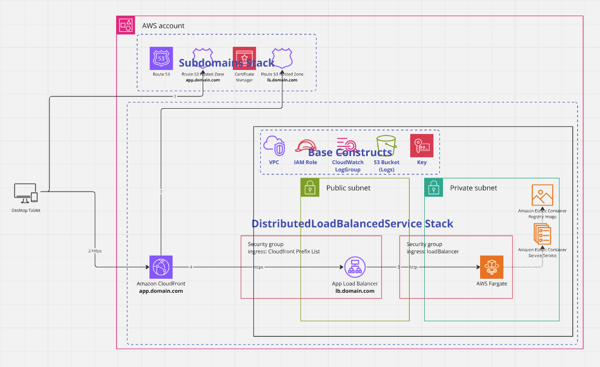

# infrastructure-blueprints
reusable solutions for infrastructure using aws-cdk

# how-to: constructs

## aws-cdk library: @jtviegas/cdk-blueprints

- library providing opinionated cdk constructs
- check [DistributedLoadBalancedServiceStack example](infrastructure/bin/infrastructure.ts)

